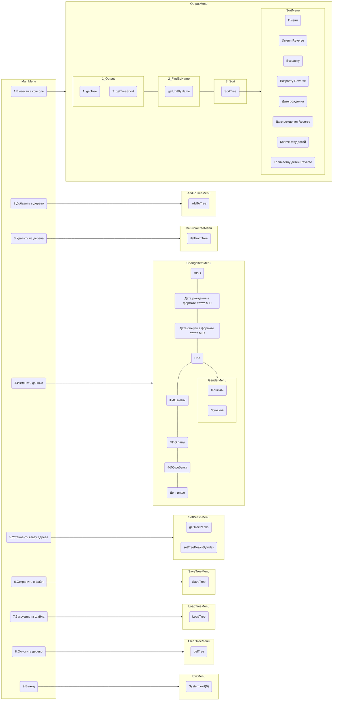

```mermaid
flowchart LR

subgraph MainMenu
A("1.Вывести в консоль")
B("2.Добавить в дерево")
C("3.Удалить из дерева")
D("4.Изменить данные")
E("5.Установить главу дерева")
F("6.Сохранить в файл")
G("7.Загрузить из файла")
H("8.Очистить дерево")
I("9.Выход")
end

subgraph OutputMenu
direction LR
subgraph 1_Output
1("1. getTree")
2("2. getTreeShort")
end
subgraph 2_FindByName
3("getUnitByName")
end
subgraph 3_Sort
14("SortTree")
end
subgraph SortMenu
direction LR
23("Имени")
24("Имени Reverse")
25("Возрасту")
26("Возрасту Reverse")
27("Дате рождения")
28("Дате рождения Reverse")
29("Количеству детей")
30("Количеству детей Reverse")
end
1_Output --- 2_FindByName --- 3_Sort
14 --> SortMenu
end


subgraph AddToTreeMenu
7("addToTree")
end

subgraph DelFromTreeMenu
8("delFromTree")
end

subgraph ChangeItemMenu
direction TB
11("ФИО")
16("Дата рождения в формате YYYY M D")
17("Дата смерти в формате YYYY M D")
18("Пол")
19("ФИО мамы")
20("ФИО папы")
21("ФИО ребенка")
22("Доп. инфо")
subgraph GenderMenu
31("Женский")
32("Мужской")
end
11 --- 16 ---17 --- 18 --- 19 --- 20 --- 21 --- 22
18 --> GenderMenu
end

subgraph SetPeaksMenu
direction LR
5("getTreePeaks")
6("setTreePeaksByIndex")
end

subgraph SaveTreeMenu
12("SaveTree")
end

subgraph LoadTreeMenu
13("LoadTree")
end

subgraph ClearTreeMenu
10("delTree")
end

subgraph ExitMenu
15("System.exit(0)")
end

A --> OutputMenu
B --> AddToTreeMenu
C --> DelFromTreeMenu
D --> ChangeItemMenu
E --> SetPeaksMenu
F --> SaveTreeMenu
G --> LoadTreeMenu
H --> ClearTreeMenu
I --> ExitMenu


```
